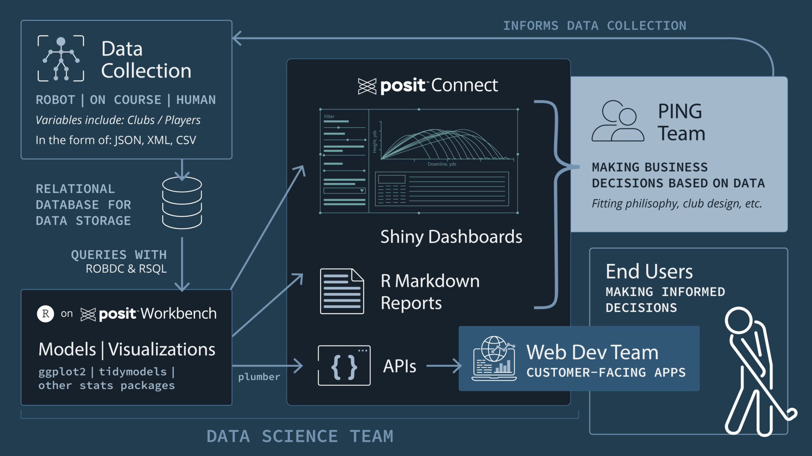

# Using R in Production with Posit Connect
## Deploying Models as APIs for Customer-Facing Applications

We walk through this workflow in a Posit Blog post, [Using R in Production with Posit Connect: Deploying Models as APIs for Customer-Facing Applications](https://posit.co/blog/using-r-in-production-with-posit-connect/).

